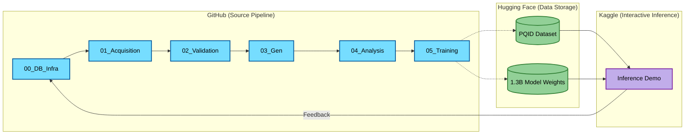
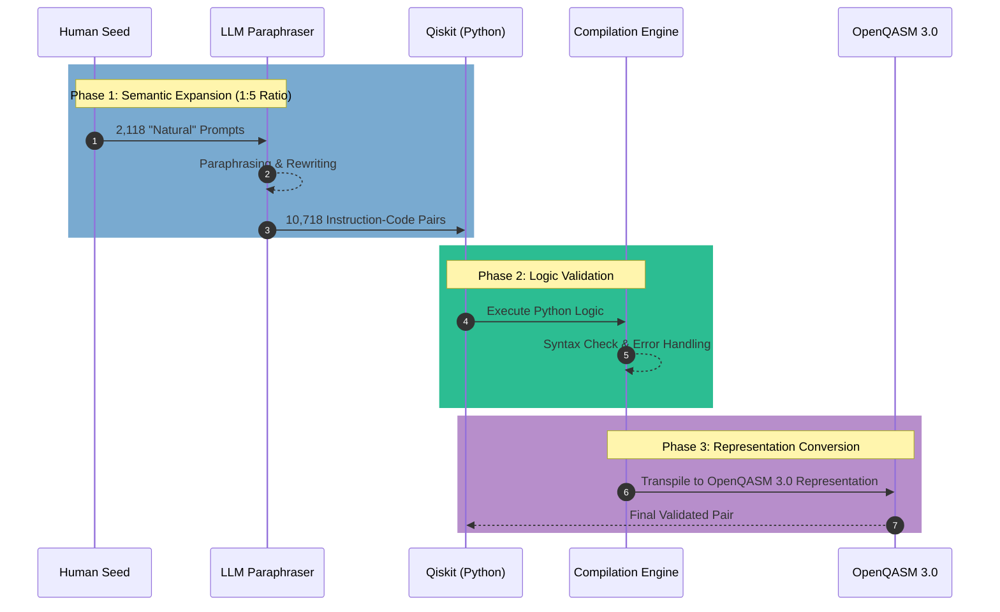
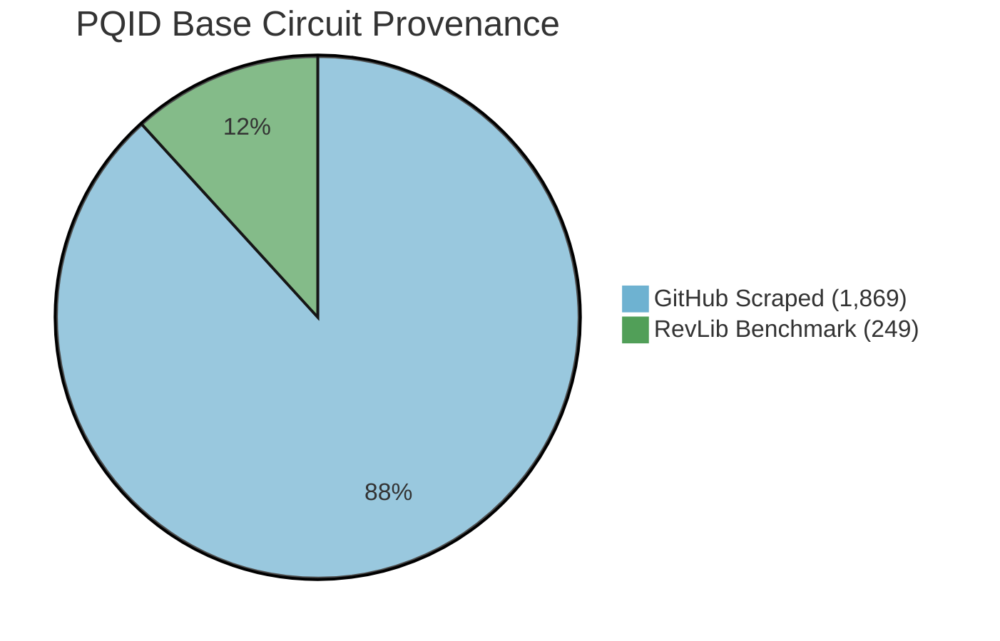
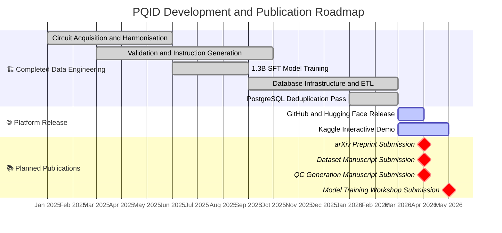

# PQID: Parallel Quantum Instruction Dataset ⚛️

[](https://huggingface.co/datasets/Elias-Abebe-Gasparini/PQID)
[](https://creativecommons.org/licenses/by/4.0/)

The **Parallel Quantum Instruction Dataset (PQID)** is a curated parallel corpus for supervised fine-tuning of large language models in quantum circuit design. It pairs natural-language instructions with standardized **IBM Qiskit** implementations and corresponding **OpenQASM 3.0** representations at an approximate 1:5 circuit-to-instruction ratio. Each code pair has been validated for Python syntactic correctness, successful circuit construction in Qiskit, and transpilation/export into **OpenQASM 3.0**.

## 📑 Table of Contents

---

- [📌 Project Overview](#-project-overview)
- [🔄 Replication Research Ecosystem](#-replication-research-ecosystem)
- [🏗️ Repository Architecture](#%EF%B8%8F-repository-architecture)
  - [📂 File Hierarchy](#-file-hierarchy)
- [🧠 The 1.3B Quantum-Instruct Model](#-the-13b-quantum-instruct-model)
- [🕹️ Interactive Inference (Upcoming)](#%EF%B8%8F-interactive-inference-upcoming)
- [🛠️ Data Transformation Pipeline](#%EF%B8%8F-data-transformation-pipeline)
- [📊 Dataset Overview](#-dataset-overview)
- [⚠️ Limitations](#%EF%B8%8F-limitations)
- [🚀 Quickstart: Loading the Dataset](#-quickstart-loading-the-dataset)
- [📜 Citation & Academic Context](#-citation--academic-context)
  - [⏳ Research Roadmap](#-research-roadmap)
- [📧 Contact](#-contact)

---

## 📌 Project Overview

Extracting and standardizing quantum circuits from heterogeneous open-source sources presents substantial parsing, memory, and compilation challenges. PQID addresses this by collecting base circuits from public GitHub repositories and the RevLib benchmark set, then processing them through a staged pipeline for normalization, validation, and representation conversion.

The resulting dataset provides instruction–code pairs linking natural-language prompts to executable **IBM Qiskit** implementations and corresponding **OpenQASM 3.0** representations. It is intended as a resource for supervised fine-tuning and evaluation of language models for quantum circuit generation and translation tasks.

## 🔄 Replication Research Ecosystem



> 🔗 **Architectural Blueprint:** [View Raw Mermaid Syntax](./ARCHITECTURE.mmd)

## 🏗️ Repository Architecture

This repository contains the complete end-to-end data engineering and training pipeline used to construct PQID and fine-tune its accompanying models. The codebase is modularized chronologically:

- **`00_database_infrastructure/`**: SQL schemas and ETL initialization for robust data storage.
- **`01_acquisition/`**: Memory-efficient scrapers and extraction logic for GitHub and RevLib archives.
- **`02_translation_and_validation/`**: The core Qiskit standardization and OpenQASM 3.0 compilation engine.
- **`03_instruction_generation/`**: Asynchronous LLM pipelines for generating natural-language instruction pairs.
- **`04_metadata_analysis/`**: Statistical validation suites (token lengths, quantum gate distributions, circuit depths).
- **`05_model_training/`**: PyTorch and Hugging Face SFT scripts used to fine-tune a 1.3B parameter model on the finalized corpus.

*(For detailed execution instructions and phase-specific documentation, please see the `scripts/README.md` file).*

### 📂 File Hierarchy

```text
PQID/
├── .gitattributes
├── .gitignore
├── ARCHITECTURE.mmd
├── README.md
├── RESEARCH_CONTEXT.md
├── .github/
│   └── FUNDING.yml
├── 00_database_infrastructure/
│   ├── DATABASE.md
│   ├── etl_and_cleaning.sql
│   ├── schema.sql
│   └── validation.sql
├── data/
│   └── processed/
│       ├── train.jsonl
│       └── validation.jsonl
└── scripts/
    ├── README.md
    ├── 01_acquisition/
    ├── 02_translation_and_validation/
    ├── 03_instruction_generation/
    ├── 04_metadata_analysis/
    └── 05_model_training/

```

## 🧠 The 1.3B Quantum-Instruct Model

To examine the training utility of the PQID corpus, a 1.3-billion-parameter language model was fine-tuned on the dataset using QLoRA and PyTorch FSDP. This model serves as an experimental downstream validation of the dataset’s usefulness for quantum circuit-generation tasks involving **IBM Qiskit** and **OpenQASM 3.0** representations. The training scripts used for these experiments are available in the `05_model_training` directory.

## 🕹️ Interactive Inference (Upcoming)

An interactive **Inference Notebook** for Kaggle is currently in preparation.

- **Status:** 🏗️ *Work in Progress (optimization for T4/P100 GPUs)*
- **Purpose:** The notebook is intended to provide a pre-configured environment for loading the **PQID-1.3B** model and running inference on natural-language prompts.
- **Why Kaggle?** Kaggle provides accessible GPU resources that can support lightweight reproducibility and exploratory testing without requiring local hardware setup.

## 🛠️ Data Transformation Pipeline



## 📊 Dataset Overview

### 🗄️ Dataset Schema

Each entry in the PQID `.jsonl` files conforms to the following schema:

| Field | Type | Description |
| :--- | :--- | :--- |
| `input` | String | The natural-language instruction or prompt describing the desired quantum logic. |
| `output` | String | The validated target quantum code (IBM Qiskit) corresponding to the input. |
| `metadata` | Dictionary | A nested JSON object containing provenance, traceability, and structural characteristics. |
| `metadata.source_dataset` | String | The originating collection of the base circuit (e.g., "GitHub" or "RevLib"). |
| `metadata.prompt_type` | String | Indicates the generation method of the prompt (e.g., "human_seed" or "paraphrase"). |
| `metadata.circuit_hash` | String | A unique hash representing the circuit's structural identity, used for deep deduplication. |
| `metadata.original_url` | String | The URL of the source repository or benchmark file where the original code was found. |
| `metadata.hash` | String | The specific commit or file hash from the source repository to ensure version traceability. |
| `metadata.end_line` | Integer | The ending line number of the extracted circuit code in the original source file. |
| `metadata.file_path` | String | The specific file path within the original source repository. |
| `metadata.start_line` | Integer | The starting line number of the extracted circuit code in the original source file. |
| `metadata.github_anchor` | String | A formatted URL fragment directly pointing to the highlighted code lines in the source repository. |

### 📐 Mathematical Formalization

The semantic expansion of the PQID corpus can be summarized by the **Instruction Density Ratio** ($\rho$), which measures the number of natural-language instruction variants associated with each validated base circuit:

$$
\rho = \frac{|P|}{|C_{base}|}
$$

where $|P|$ denotes the total number of instruction-tuned prompts (10,718), and $|C_{base}|$ denotes the number of unique validated base circuits (2,118).

For PQID v1.0, this yields $\rho \approx 5.06$. This ratio reflects the dataset’s emphasis on paraphrastic diversity, with multiple natural-language formulations mapped to the same underlying circuit structure. In practice, this design is intended to support training and evaluation under linguistic variation by reducing reliance on single phrasing patterns.

- **Total Prompts:** 10,718
- **Base Circuits:** 2,118 (1,869 GitHub / 249 RevLib)
- **Languages:** Qiskit, OpenQASM 3.0



### 🛡️ Data Quality & Deduplication

PQID underwent a multi-stage validation and deduplication process during dataset construction:

- **Relational Integrity:** A PostgreSQL backend was used to manage the mapping between base circuits and their associated natural-language instruction variants.
- **Deep Deduplication:** A SQL-based `ctid` analysis was used to identify and remove **29 semantic duplicates** that bypassed earlier Python-based string-matching filters.
- **Code and Representation Validation:** Each circuit pair was checked for Python syntactic correctness, successful circuit construction in Qiskit, and successful transpilation/export into **OpenQASM 3.0**.

### 📈 Dataset Splits & Generalization

To reduce direct memorization of original prompt phrasing and encourage evaluation under linguistic variation, PQID uses a split based on paraphrased versus seed instructions:

- **Training/Validation (10,718 entries):** Consists of paraphrased instruction variants.
- **Test Set (2,118 entries):** Consists exclusively of the original human-authored seed prompts.

This evaluation setup tests model performance on instruction formulations that were not seen in their original form during training, providing a stricter measure of robustness to phrasing variation.

## ⚠️ Limitations

PQID is intended as a validated resource for quantum instruction–code research, but several limitations should be noted:

- **Paraphrase-based instruction expansion:** Most instruction variants were generated through paraphrastic expansion rather than independently authored by multiple human annotators. As a result, the dataset captures linguistic variation, but not the full diversity of naturally occurring user prompts.
- **Validation scope:** Dataset validation covers Python syntactic correctness, successful circuit construction in Qiskit, and transpilation/export into **OpenQASM 3.0**. This should not be interpreted as universal proof of semantic equivalence, hardware execution success across all backends, or full functional correctness in every downstream setting.
- **Source distribution bias:** The base circuits were collected from public GitHub repositories and the RevLib benchmark set. Consequently, the dataset may reflect the stylistic, structural, and task-distribution biases of those sources rather than the full space of quantum programming practice.
- **Task and framework scope:** PQID is currently centered on natural-language mappings to **IBM Qiskit** and **OpenQASM 3.0** representations. It does not yet cover a broader range of quantum software stacks, multilingual human-language instructions, or alternative hardware/software ecosystems.
- **Model scale constraints:** The accompanying fine-tuning experiments were conducted on a **1.3B-parameter** model, which should be understood as a resource-constrained experimental baseline rather than an upper bound on the dataset’s utility. Evaluation on substantially larger open models—such as **DeepSeek-R1-Distill-Qwen-32B**, **DeepSeek-R1-Distill-Llama-70B**, or larger DeepSeek-family MoE systems such as **DeepSeek-R1**—would provide a stronger test of how PQID scales with increased model capacity, but such experiments were beyond the compute and financial resources available for the present study.
- **Model-performance interpretation:** The accompanying fine-tuning experiments are intended to demonstrate the dataset’s utility, not to establish that direct generation from PQID alone is sufficient for fully reliable deployment-ready quantum code generation in all cases.

## 🚀 Quickstart: Loading the Dataset

The finalized dataset is hosted on Hugging Face and can be instantly loaded into the target environment:

```python
# Load the dataset directly from the Hugging Face Hub
from datasets import load_dataset
dataset = load_dataset("Elias-Abebe-Gasparini/PQID")

print(dataset[0]["input"])
print(dataset[0]["output"])

```

## 📜 Citation & Academic Context

### 📝 How to Cite

If you use the PQID dataset or this pipeline in your research, please cite it as follows:

```bibtex
@misc{gasparini2026pqid,
  author = {Gasparini, Elias A.},
  title = {PQID: Parallel Quantum Instruction Dataset for Fine-Tuning Large Language Models in Quantum Circuit Design},
  year = {2026},
  publisher = {GitHub},
  journal = {GitHub Repository},
  howpublished = {\url{https://github.com/Elias-Abebe-Gasparini/PQID-Dataset}}
}

```

### 🔬 Research Context

This dataset and its accompanying compilation pipeline were developed as part of a Master's Thesis in the **Department of Innovation** at **Yonsei University**. For full details regarding the project's independent methodology, funding status, and institutional affiliation, please refer to the [RESEARCH_CONTEXT.md](./RESEARCH_CONTEXT.md) document.

### ⏳ Research Roadmap



## 📧 Contact

For technical inquiries, dataset access, or collaboration opportunities:

- **GitHub:** [Open an Issue](https://github.com/Elias-Abebe-Gasparini/PQID-Dataset/issues)
- **LinkedIn:** [Elias A. Gasparini](https://www.linkedin.com/in/elias-abebe-gasparini/)
