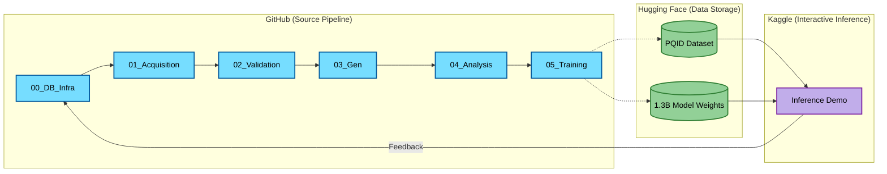
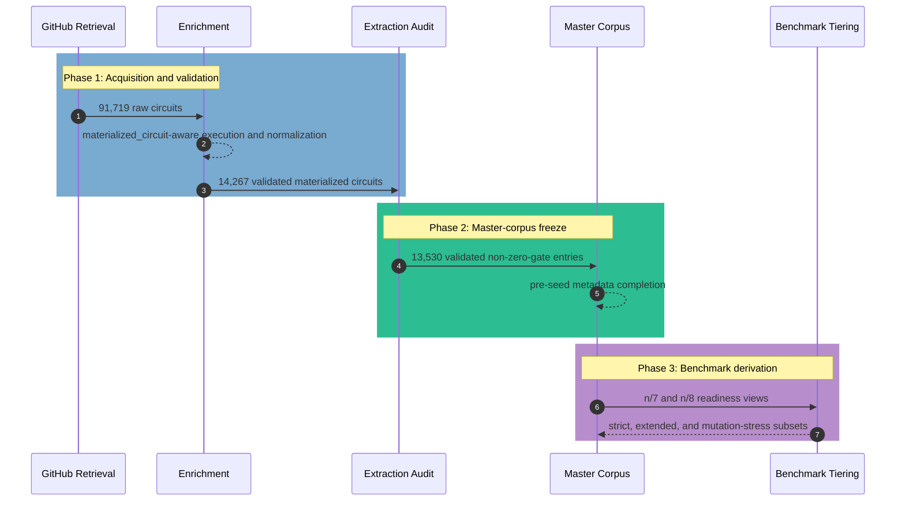
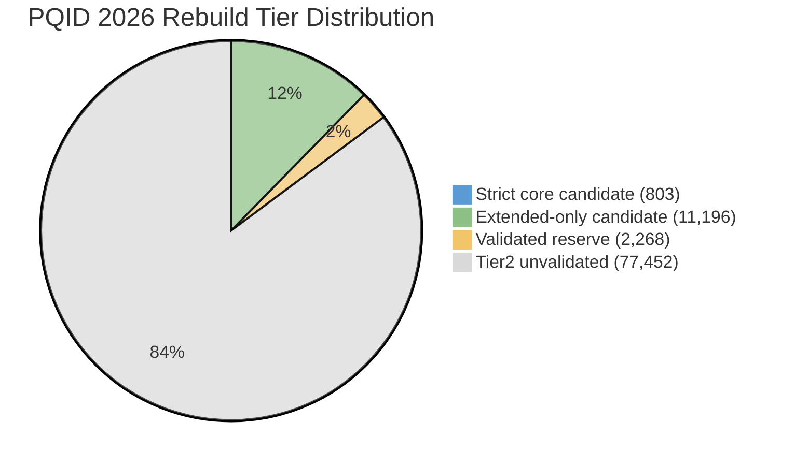
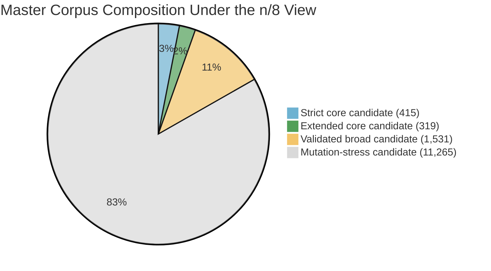

# PQID: Parallel Quantum Instruction Dataset ⚛️

[](https://huggingface.co/datasets/Elias-Abebe-Gasparini/PQID)
[](https://creativecommons.org/licenses/by/4.0/)

The **Parallel Quantum Instruction Dataset (PQID)** is a curated parallel corpus for supervised fine-tuning of large language models in quantum circuit design. It pairs natural-language instructions with standardized **IBM Qiskit** implementations and corresponding **OpenQASM 3.0** representations.

The original thesis-era corpus remains part of the project and is preserved below in its original presentation logic. The active repository, however, now reflects the **2026 GitHub rebuild**, whose current headline counts are:

- **91,719** raw merged circuits
- **14,267** validated materialized circuits
- **13,530** validated non-zero-gate entries in the frozen master processable corpus
- benchmark views of **803 / 11,999** under `n/7`
- cleanliness-aware benchmark views of **415 / 734** under `n/8`

The current full PQID schema now documents **149 metadata fields across 17 documented clusters**. The active pre-seed merged `metadata_design_v3` corpus materializes **146** of those metadata keys, with the remaining generation-only fields appearing later on seed and paraphrase artifacts.

The freeze-ready v1 instruction layer contains **550,314** rows: **91,719** seeds and **458,595** paraphrases. The Stage K acceptance pilot has been adjudicated to **209 accept / 47 rewrite**, and the reviewed JSONL / summary sidecars have been synced after that adjudication. A bounded remediation sidecar closes the `47` rewrite-required rows plus `235` same-lineage neighbors (`282` candidates total): the materialized result layer now records `282 / 282` rewritten outputs after two final manual closeout overrides, without mutating the canonical acceptance-gate manifest.

Public release is intentionally narrower than the full construction corpus. The current release-ready views live under `PQID/data/processed/release_views/`: `pqid_v1_public_open_*` contains **311,724** permissive-license rows, while `pqid_v1_license_valid_*` contains **319,782** license-valid rows by adding **7,356** copyleft rows and **702** manually reviewed `other`-license rows with downstream obligations preserved. Unresolved/no-license rows remain restricted/internal. The final license-normalization pass recoded the former `18` missing-license-category rows into explicit `no_license`, so the current missing-license internal manifest contains **0** rows.

Documentation scope note:
- `README.md` is the project-facing overview
- `PIPELINE.md` is the full operational master log
- `SCHEMA.md` is the authoritative metadata inventory

So if `README.md` ever feels shorter than before, that is mostly because more implementation detail has been moved into the pipeline and schema references to avoid contradictory duplicate documentation.

## 📑 Table of Contents

---

- [📌 Project Overview](#-project-overview)
- [🔄 Replication Research Ecosystem](#-replication-research-ecosystem)
- [🏗️ Repository Architecture](#%EF%B8%8F-repository-architecture)
  - [📂 File Hierarchy](#-file-hierarchy)
- [🧠 The 1.3B Quantum-Instruct Model](#-the-13b-quantum-instruct-model)
- [🕹️ Interactive Inference (Upcoming)](#%EF%B8%8F-interactive-inference-upcoming)
- [🛠️ Data Transformation Pipeline](#%EF%B8%8F-data-transformation-pipeline)
- [📊 Dataset Overview](#-dataset-overview)
  - [🗂️ Current 2026 Rebuild Snapshot](#%EF%B8%8F-current-2026-rebuild-snapshot)
  - [🗄️ Dataset Schema](#%EF%B8%8F-dataset-schema)
  - [📐 Mathematical Formalization](#-mathematical-formalization)
  - [🛡️ Data Quality & Deduplication](#%EF%B8%8F-data-quality--deduplication)
  - [📈 Dataset Splits & Generalization](#-dataset-splits--generalization)
- [⚠️ Limitations](#%EF%B8%8F-limitations)
- [🚀 Quickstart: Loading the Dataset](#-quickstart-loading-the-dataset)
- [📜 Citation & Academic Context](#-citation--academic-context)
  - [📝 How to Cite](#-how-to-cite)
  - [🔬 Research Context](#-research-context)
- [📧 Contact](#-contact)

---

## 📌 Project Overview

Extracting and standardizing quantum circuits from heterogeneous open-source sources presents substantial parsing, memory, and compilation challenges. PQID addresses this by collecting base circuits from public GitHub repositories and the RevLib benchmark set, then processing them through a staged pipeline for normalization, validation, and representation conversion.

The resulting dataset provides instruction-code and benchmark-oriented artifacts linking natural-language prompts, executable **IBM Qiskit** implementations, and corresponding **OpenQASM 3.0** representations. It is intended as a resource for supervised fine-tuning, evaluation, and later metadata-aware benchmark design for language models in quantum circuit generation and translation tasks.

## 🔄 Replication Research Ecosystem


```mermaid
graph LR
%% Class Definitions (Added color:#000000 to force black text)
    classDef github fill:#76ddff,stroke:#01579b,stroke-width:2px,color:#000000;
    classDef hf fill:#92d097,stroke:#2e7d32,stroke-width:2px,color:#000000;
    classDef kaggle fill:#c1adea,stroke:#7b1fa2,stroke-width:2px,color:#000000;

    subgraph "GitHub (Source Pipeline)"
        A[00_DB_Infra] --> B[01_Acquisition]
        B --> C[02_Validation]
        C --> D[03_Gen]
        D --> E[04_Analysis]
        E --> F[05_Training]
    end

    subgraph "Hugging Face (Data Storage)"
        G[(PQID Dataset)]
        H[(1.3B Model Weights)]
    end

    subgraph "Kaggle (Interactive Inference)"
        I[Inference Demo]
    end

    %% Applying Classes
    class A,B,C,D,E,F github;
    class G,H hf;
    class I kaggle;

    %% Connections
    F -.-> G
    F -.-> H
    G --> I
    H --> I
    I -- Feedback --> A
```

> 🔗 **Architectural Blueprint:** [View Raw Mermaid Syntax](./ARCHITECTURE.mmd)

## 🏗️ Repository Architecture

This repository contains the complete end-to-end data engineering and training pipeline used to construct PQID and fine-tune its accompanying models. The codebase is modularized chronologically:

- **`00_database_infrastructure/`**: SQL schemas and ETL initialization for robust data storage.
- **`01_acquisition/`**: Memory-efficient scrapers and extraction logic for GitHub and RevLib archives.
- **`02_translation_and_validation/`**: The core Qiskit standardization and OpenQASM 3.0 compilation engine.
- **`03_instruction_generation/`**: Asynchronous LLM pipelines for generating natural-language instruction pairs.
- **`04_metadata_analysis/`**: Statistical validation suites, benchmark-readiness analyses, and corpus-level diagnostics.
- **`05_model_training/`**: PyTorch and Hugging Face SFT scripts used to fine-tune baseline models on earlier finalized corpora.

*(For detailed execution instructions and phase-specific documentation, please see the `scripts/README.md` file.)*

### 📂 File Hierarchy

```text
PQID/
├── .gitattributes
├── .gitignore
├── ARCHITECTURE.mmd
├── README.md
├── PIPELINE.md
├── SCHEMA.md
├── 00_database_infrastructure/
│   ├── DATABASE.md
│   ├── etl_and_cleaning.sql
│   ├── schema.sql
│   └── validation.sql
├── data/
│   └── processed/
│       ├── pqid_2026_master_corpus.jsonl
│       ├── pqid_2026_benchmark_strict.jsonl
│       ├── pqid_2026_benchmark_extended.jsonl
│       ├── pqid_2026_benchmark_strict_clean.jsonl
│       ├── pqid_2026_benchmark_extended_clean.jsonl
│       └── *.md reports
└── scripts/
    ├── README.md
    ├── 01_acquisition/
    ├── 02_translation_and_validation/
    ├── 03_instruction_generation/
    ├── 04_metadata_analysis/
    ├── scrape_github_unified.ipynb
    └── 05_model_training/

```

## 🧠 The 1.3B Quantum-Instruct Model

To examine the training utility of the PQID corpus, a 1.3-billion-parameter language model was fine-tuned on the dataset using QLoRA and PyTorch FSDP. This model serves as an experimental downstream validation of the dataset’s usefulness for quantum circuit-generation tasks involving **IBM Qiskit** and **OpenQASM 3.0** representations. The training scripts used for these experiments are available in the `05_model_training` directory.

That model should be interpreted as part of the **earlier thesis-scale PQID layer**, not as a model trained on the current 2026 rebuild.

## 🕹️ Interactive Inference (Upcoming)

An interactive **Inference Notebook** for Kaggle is currently in preparation.

- **Status:** 🏗️ *Work in Progress (optimization for T4/P100 GPUs)*
- **Purpose:** The notebook is intended to provide a pre-configured environment for loading the **PQID-1.3B** model and running inference on natural-language prompts.
- **Why Kaggle?** Kaggle provides accessible GPU resources that can support lightweight reproducibility and exploratory testing without requiring local hardware setup.

## 🛠️ Data Transformation Pipeline

The original thesis-era figure is preserved below in its original position, but the counts have been updated to reflect the current rebuild state.


```mermaid
%%{init: {'themeVariables': {'noteTextColor': '#000000', 'messageTextColor': '#000000', 'actorTextColor': '#000000'}}}%%
sequenceDiagram
    autonumber
    participant GH as GitHub Retrieval
    participant EN as Enrichment
    participant QA as Extraction Audit
    participant MC as Master Corpus
    participant BT as Benchmark Tiering

    rect rgb(121, 170, 208)
    Note over GH,EN: Phase 1: Acquisition and validation
    GH->>EN: 91,719 raw circuits
    EN-->>EN: materialized_circuit-aware execution and normalization
    EN->>QA: 14,267 validated materialized circuits
    end

    rect rgb(44, 189, 146)
    Note over QA,MC: Phase 2: Master-corpus freeze
    QA->>MC: 13,530 validated non-zero-gate entries
    MC-->>MC: pre-seed metadata completion
    end

    rect rgb(183, 142, 203)
    Note over MC,BT: Phase 3: Benchmark derivation
    MC->>BT: n/7 and n/8 readiness views
    BT-->>MC: strict, extended, and mutation-stress subsets
    end
```

## 📊 Dataset Overview

### 🗂️ Current 2026 Rebuild Snapshot

The active rebuild is now best understood through the following corrected counts:

| Artifact | Count | Notes |
| :--- | ---: | :--- |
| Raw merged circuits | 91,719 | unified multi-phase GitHub rebuild |
| Validated materialized circuits | 14,267 | `validation_status == "validated"` and `materialized_circuit == True` |
| Validated non-zero-gate circuits | 13,530 | current frozen master processable corpus |
| Strict benchmark core (`n/7`) | 803 | original highest-trust subset |
| Extended benchmark core (`n/7`) | 11,999 | original broad benchmark-facing subset |
| Strict benchmark core (`n/8`) | 415 | cleanliness-aware strict subset |
| Extended benchmark core (`n/8`) | 734 | cleanliness-aware extended subset |
| Mutation-stress block (`n/8`) | 11,265 | mutation-suite / bug-stress layer |


```mermaid
%%{init: {'theme': 'base', 'themeVariables': { 'pie1': '#5b9bd5', 'pie2': '#8cc084', 'pie3': '#f3c56b', 'pie4': '#d9d9d9'}}}%%
pie title PQID 2026 Rebuild Tier Distribution
    "Strict core candidate (803)" : 803
    "Extended-only candidate (11,196)" : 11196
    "Validated reserve (2,268)" : 2268
    "Tier2 unvalidated (77,452)" : 77452
```

### 🗄️ Dataset Schema

Each entry in the PQID `.jsonl` files conforms to the following schema:

| Field | Type | Description |
| :--- | :--- | :--- |
| `input` | String | The natural-language instruction or prompt describing the desired quantum logic. |
| `output` | String | The validated target quantum code corresponding to the input. GitHub-sourced entries contain **IBM Qiskit** implementations. |
| `openqasm3_code` | String or `null` | The OpenQASM 3.0 export of the extracted circuit, when available. |
| `metadata` | Dictionary | A nested JSON object containing provenance, traceability, structural characteristics, and benchmark-readiness annotations. |
| `metadata.source_dataset` | String | The originating collection of the base circuit (e.g. `"github"` or `"revlib"` in legacy material). |
| `metadata.prompt_type` | String | Indicates the generation method of the prompt (e.g. `"human_seed"` or `"paraphrased"` in the legacy instruction corpus). |
| `metadata.circuit_hash` | String | A unique hash representing the circuit's structural identity, used for deep deduplication. |
| `metadata.original_url` | String | The URL of the source repository or benchmark file where the original code was found. |
| `metadata.hash` | String | The specific commit or file hash from the source repository to ensure version traceability. |
| `metadata.end_line` | Integer | The ending line number of the extracted circuit code in the original source file. |
| `metadata.file_path` | String | The specific file path within the original source repository. |
| `metadata.start_line` | Integer | The starting line number of the extracted circuit code in the original source file. |
| `metadata.github_anchor` | String | A formatted URL fragment directly pointing to the highlighted code lines in the source repository. |

The current rebuild adds a much richer metadata layer than the original thesis corpus, including:

- validation outcomes and `materialized_circuit`
- structural and transpilation metrics
- repository context and license metadata
- `circuit_family` and `semantic_intent`
- benchmark readiness under both **`n/7`** and **`n/8`**
- the additive `metadata_design_v3` transparency layer, including provenance, governance, split, benchmark-packaging, lineage, and audit-trace fields such as:
  - `source_snapshot_timestamp`
  - `source_snapshot_granularity`
  - `source_revision_id`
  - `license_evidence_source`
  - `license_detection_method`
  - `release_view_membership`
  - `lineage_parent_id`
  - `benchmark_view_membership`
  - `near_duplicate_group_id`
  - `domain_slice`
  - `shift_axis`
  - `review_trace_id`
  - `permission_response_status`
  - `manual_license_review_status`

### 📐 Mathematical Formalization

The original semantic expansion of the PQID corpus can be summarized by the **Instruction Density Ratio** (`rho`), which measures the number of natural-language instruction variants associated with each validated base circuit:

`rho = |P| / |C_base|`

For the thesis-era PQID instruction corpus, this yielded approximately:

- **Total Prompts:** 10,718
- **Base Circuits:** 2,118 (1,869 GitHub / 249 RevLib)
- **Languages:** Qiskit, OpenQASM 3.0

For the active rebuild, the mathematically relevant benchmark formalization is now the paired readiness system:

- `S_7 = X_1 + X_2 + ... + X_7`
- `S_8 = S_7 + M`

where `M` is the late-stage cleanliness indicator for `non_mutation_suite_path`.


```mermaid
%%{init: {'theme': 'base', 'themeVariables': { 'pie1': '#6eb2d1', 'pie2': '#519f58', 'pie3': '#f3c56b', 'pie4': '#d9d9d9'}}}%%
pie title Master Corpus Composition Under the n/8 View
    "Strict core candidate (415)" : 415
    "Extended core candidate (319)" : 319
    "Validated broad candidate (1,531)" : 1531
    "Mutation-stress candidate (11,265)" : 11265
```

### 🛡️ Data Quality & Deduplication

PQID underwent a multi-stage validation and deduplication process during dataset construction, and the active rebuild extends that philosophy further:

- **Relational Integrity:** A PostgreSQL backend was used to manage mapping and traceability across corpus layers.
- **Deep Deduplication:** SQL- and hash-based analysis was used to identify and remove semantic duplicates that bypassed earlier surface-level filters.
- **Code and Representation Validation:** Circuits were checked for Python syntactic correctness, successful circuit construction in Qiskit, and OpenQASM exportability where applicable.
- **Current rebuild correction:** Earlier broad `validated` totals were found to be inflated by placeholder circuits such as `qc` and `circ`; the active pipeline now tracks `materialized_circuit` explicitly.
- **Benchmark cleaning:** The rebuild now also separates mutation-heavy material through the `non_mutation_suite_path` criterion instead of letting it silently dominate the benchmark-facing interpretation.

### 📈 Dataset Splits & Generalization

To reduce direct memorization of original prompt phrasing and encourage evaluation under linguistic variation, the **legacy instruction corpus** used a split based on paraphrased versus seed instructions:

- **Training/Validation (10,718 entries):** paraphrased instruction variants
- **Test Set (2,118 entries):** original human-authored seed prompts

For the **current rebuild**, the more relevant split logic is now benchmark-oriented:

- **Master processable corpus:** 13,530
- **Original benchmark view (`n/7`):** strict core 803, extended core 11,999
- **Cleanliness-aware benchmark view (`n/8`):** strict core 415, extended core 734, mutation-stress block 11,265

This means the rebuild supports a stricter, metadata-aware notion of generalization than the original paraphrase-only split design.

## ⚠️ Limitations

PQID is intended as a validated resource for quantum instruction-code research, but several limitations should be noted:

- **Paraphrase-based instruction expansion:** Most thesis-era instruction variants were generated through paraphrastic expansion rather than independently authored by multiple human annotators. As a result, the legacy corpus captures linguistic variation, but not the full diversity of naturally occurring user prompts.
- **Validation scope:** Dataset validation covers Python syntactic correctness, successful circuit construction in Qiskit, and transpilation/export into **OpenQASM 3.0** where applicable. This should not be interpreted as universal proof of semantic equivalence, hardware execution success across all backends, or full functional correctness in every downstream setting.
- **Source distribution bias:** The base circuits were collected from public repositories and benchmark sources. Consequently, the dataset may reflect the stylistic, structural, and task-distribution biases of those sources rather than the full space of quantum programming practice.
- **Provenance-limited secondary sources:** Rows whose licensing or provenance cannot be resolved are retained only in restricted/internal views and are not included in the public-open release.
- **Task and framework scope:** PQID is currently centered on natural-language mappings to **IBM Qiskit** and **OpenQASM 3.0** representations. The instruction surface is **English-dominant**, but the corpus is not strictly English-only: source-grounded outputs can preserve multilingual upstream comments/docstrings, and a heuristic language-audit sidecar is used to quantify that distribution. In the current acceptance-gate manifest, `550,300 / 550,314` inputs resolve as English and `14` resolve as Bengali. On the output side, multilingual traces are small and concentrated in the source-grounded tail: `216` Spanish, `132` Portuguese, `78` French, `156` Japanese, `90` Korean, `12` unresolved Cyrillic-script rows, and `330` short fragments, alongside `9,660` `code_only` outputs. For reproducibility, the audit keeps both raw and resolved labels rather than collapsing them into one opaque `unknown` bucket. PQID still does not aim to cover a broader range of quantum software stacks or alternative hardware/software ecosystems.
- **Benchmark complexity:** The 2026 rebuild is no longer just a small instruction corpus; it is also a benchmark-derivation and metadata-audit framework, which makes it richer but less plug-and-play than tiny evaluation-only benchmarks.
- **Model-performance interpretation:** The accompanying fine-tuning experiments are intended to demonstrate the dataset’s utility, not to establish that direct generation from PQID alone is sufficient for fully reliable deployment-ready quantum code generation in all cases.

## 🚀 Quickstart: Loading the Dataset

The finalized dataset is hosted on Hugging Face and local processed JSONL artifacts can also be loaded directly.

```python
# Load the dataset directly from the Hugging Face Hub
from datasets import load_dataset
dataset = load_dataset("Elias-Abebe-Gasparini/PQID")

print(dataset)
```

```python
# Load the current publication-facing master corpus locally
import json
from pathlib import Path

root = Path("PQID/data/processed")
path = root / "pqid_2026_master_corpus.jsonl"

with open(path, encoding="utf-8") as f:
    first = json.loads(next(f))

print(first["metadata"]["benchmark_suitability_tier"])
print(first["metadata"]["benchmark_suitability_tier_v2"])
print(first["output"][:300])
```

## 📜 Citation & Academic Context

### 📝 How to Cite

If you use the PQID dataset or this pipeline in your research, please cite it as follows:

```bibtex
@misc{gasparini2026pqid,
  author = {Gasparini, Elias A.},
  title = {PQID: Parallel Quantum Instruction Dataset for Fine-Tuning Large Language Models in Quantum Circuit Design},
  year = {2026},
  publisher = {GitHub},
  journal = {GitHub Repository},
  howpublished = {\url{https://github.com/Elias-Abebe-Gasparini/PQID-Dataset}}
}

```

### 🔬 Research Context

This dataset and its accompanying compilation pipeline were developed as part of a Master's Thesis in the **Department of Innovation** at **Yonsei University** and have since evolved into a broader rebuild and benchmark-construction effort. For full details regarding the project's independent methodology, current metadata layer, and institutional framing, please refer to:

- [PIPELINE.md](./PIPELINE.md)
- [SCHEMA.md](./SCHEMA.md)

## 📧 Contact

For technical inquiries, dataset access, or collaboration opportunities:

- **GitHub:** [Open an Issue](https://github.com/Elias-Abebe-Gasparini/PQID-Dataset/issues)
- **LinkedIn:** [Elias A. Gasparini](https://www.linkedin.com/in/elias-abebe-gasparini/)
